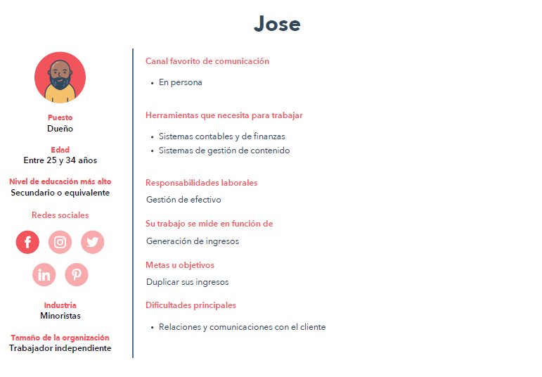

# Practica Launch X Abogabot
## Requerimentos del proyecto

**Descripción de la solicitud**

**Usuario Solicitante:**

En nuestra empresa lo mas importante son nuestros clientes. Para el gran flujo de clientes que tenemos en indipensable automatizar las demandas de los susodichos.
Con lo anterios dicho requerimos una pagina web que pueda suplir la necesidad de que nuestros clientes puedan hace sus demandas de forma automatiza, rapida y sencilla. Donde pueda dar seguimiento a su caso de forma actualizada, asi mismo el adminostrador debera ser notificado de dicha demanda entrante con todos los elementos proporcionados en el formulario del cliente. Dichos elementos deben hacerse llegar en un documento de word para si mismo empezar el proceso. Despues de efectuar el pago el administrador podra ver la cantidad ingresos en un dashboard. El administrador podra actualizar y comentar como sigue el proceso. Una vez actualizado el usuario sera notificado de dicha actualizacion. Debera ser una pagina resposiva que se pueda ver tganto como en compuadores asi como en dispositivos moviles. La preferncia de colores del cliente es azul marino y blanco, pero acepta propuestas. 

**Lider Funcional:**

Nuestra tarea es hacer modelar esta pagina web que tenga dos perspectivas. La primera que es la del cliente y la segunda la del administrador que se pueda visualizar tanto como en dispositvos moviles y computadores. Los clientes puedan acceder a los servicios de manera de formulario y recibir notificaciones. El administrador podra dar seguimiento a cada uno de los casos de sus clientes asi como podra ver sus ingresos en dicha pagina.

## Buyer persona

